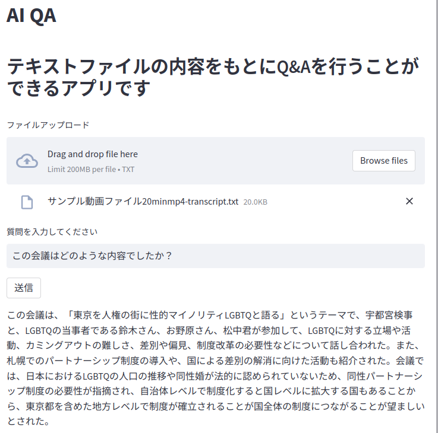

# AI Q&A

テキストファイルを読み込ませて、チャット形式でそのファイルの内容について質問することができます。



# Features

会議の文字起こしやマニュアルなどから必要な情報を抽出することができます。

# Usage

プロジェクトディレクトリをダウンロードします。
```bash
git clone https://github.com/hoge/~
```

app.py の５行目に自身で取得したopenAIのAPIキーを入力してください。

```python
openai.api_key = "あなたのopenAIのAPIキーを入力してください"
```

プロジェクトディレクトリに移動し、イメージのビルド、コンテナの起動を行います。
```bash
cd examples
docker build -t streamlit
docker run -p 8501:8501 streamlit . 
```
ローカルホストでアクセスします。http://localhost:8501

# Note
作成にあたり、以下のサイトのコードを参考にさせていただきました。
<br>https://qiita.com/sakasegawa/items/16714fa132e874cab069
# Author

* 藤川郁也
* 九州大学
* tsukutakun@icloud.com
